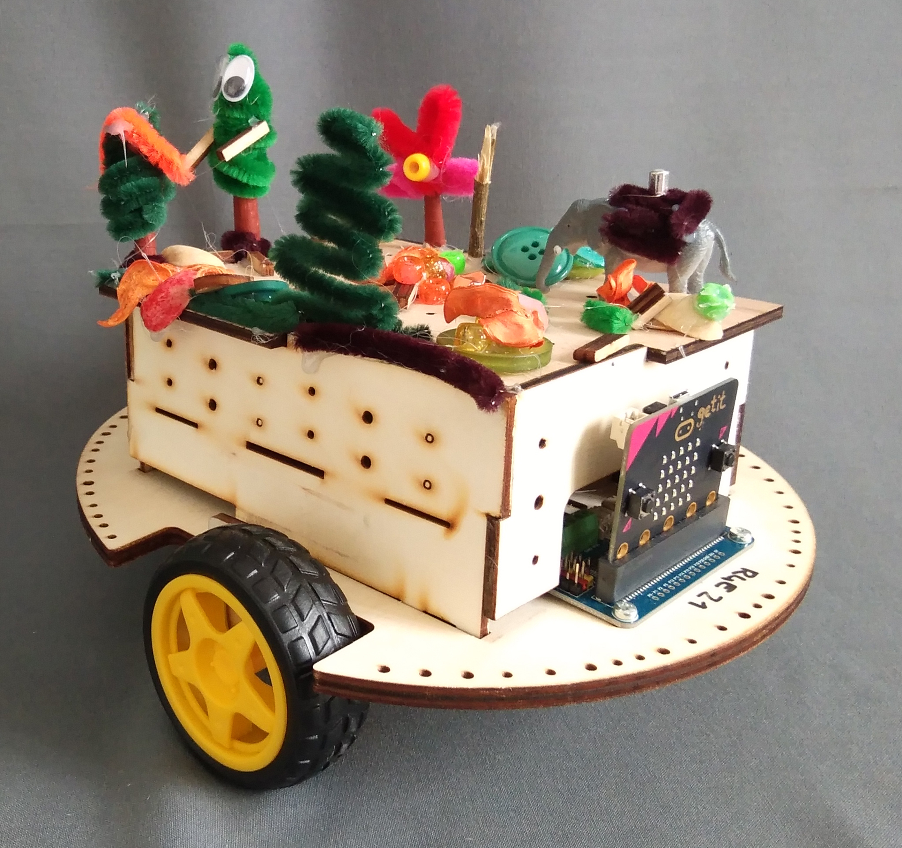

> Diese Seite bei [https://zimdaustria.github.io/pxt-robo4earth/](https://zimdaustria.github.io/pxt-robo4earth/) öffnen

# Robo4earth Erweiterung für Makecode
Dieses Repository enthält die Makecode Erweiterung für die [ZIMD]() Roboter. Damit kannst du die Roboter bewegen und Musik abspielen.
Wenn du deine eigene Robot4earth bauen und gestalten willst findest du alle benötigten Materialien auf unserer [robo4earth website](https://www.robo4earth.at/#roboter)

<br/>

## Als Erweiterung verwenden

Dieses Repository kann als **Erweiterung** in MakeCode hinzugefügt werden.

* öffne [https://makecode.microbit.org/](https://makecode.microbit.org/)
* klicke auf **Neues Projekt**
* klicke auf **Erweiterungen** unter dem Zahnrad-Menü
* nach **https://github.com/zimdaustria/pxt-robo4earth** suchen und importieren

## Dieses Projekt bearbeiten 

Um dieses Repository in MakeCode zu bearbeiten.

* öffne [https://makecode.microbit.org/](https://makecode.microbit.org/)
* klicke auf **Importieren** und dann auf **Importiere URL**
* füge **https://github.com/zimdaustria/pxt-robo4earth** ein und klicke auf Importieren

##  Verwendungsbeispiel
```blocks

// die Robo4earth spielt einen Tusch
robo4earth.playMelody(R4eMelodies.Fanfare)

// Die Robo4earth fährt vorwärts für 2 Sekunden mit Tempo 10
robo4earth.drive(R4eMotorDirection.forward, 2, 10);

// Die Robo4earth fährt Rückwärts bis die Motoren gestoppt werden
robo4earth.driveBackward(10)
basic.pause(1000)
// stop motors
robo4earth.stopMovement()

```
#### Metadaten (verwendet für Suche, Rendering)

* for PXT/microbit
<script src="https://makecode.com/gh-pages-embed.js"></script><script>makeCodeRender("{{ site.makecode.home_url }}", "{{ site.github.owner_name }}/{{ site.github.repository_name }}");</script>
