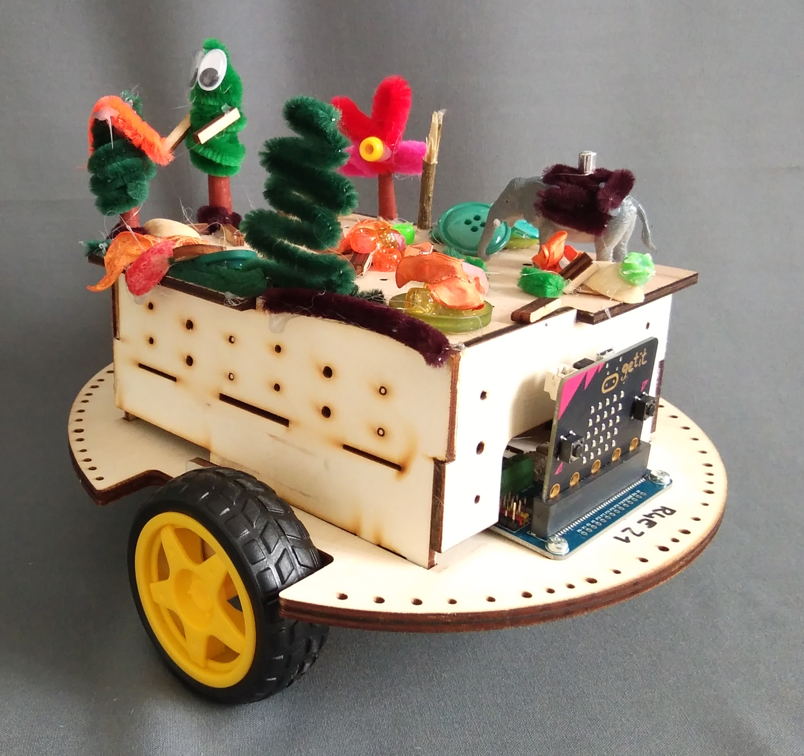

> open this page at [https://zimdaustria.github.io/pxt-robo4earth/](https://zimdaustria.github.io/pxt-robo4earth/)


# Robot4Earth for MakeCode

This repository hosts the extension to program the [ZIMD](https://www.zimd.at/) robots with MakeCode. The extension allows you to move them and let them play melodies.
The robot is utilizing the [waveshare motorboard](https://www.waveshare.com/wiki/Motor_Driver_for_micro:bit). You can use their extension if you want to add servo motors to the robot.
If you want to build your own robot you'll find everything you need on our [robo4earth website](https://www.robo4earth.at/#roboter)<br/>

<br/>

## Use as Extension in MakeCode

You can add this repository as an **Extension** in MakeCode.

* open [https://makecode.microbit.org/](https://makecode.microbit.org/)
* click on **New Project**
* click on **Extensions**
* search for **https://github.com/zimdaustria/pxt-robo4earth** in the search box

## API code example

```
// let robot play fanfare
r4E.playMelody(R4eMelodies.Fanfare);

// let robot turn on the spot for 1 second
r4E.turnMotor(R4eMotor.Left, R4eTurn.Backward, 10);
r4E.turnMotor(R4eMotor.Right, R4eTurn.Forward, 10);
basic.pause(1000);
r4E.stopMotor(R4eMotor.Left);
r4E.stopMotor(R4eMotor.Right);

// let robot move forward for 2 seconds
r4E.move(R4eMotorDirection.forward, 2, 10);
```

## API blocks

<br/>

#### Metadata (used for search/rendering)

* for PXT/microbit
<script src="https://makecode.com/gh-pages-embed.js"></script><script>makeCodeRender("{{ site.makecode.home_url }}", "{{ site.github.owner_name }}/{{ site.github.repository_name }}");</script>
