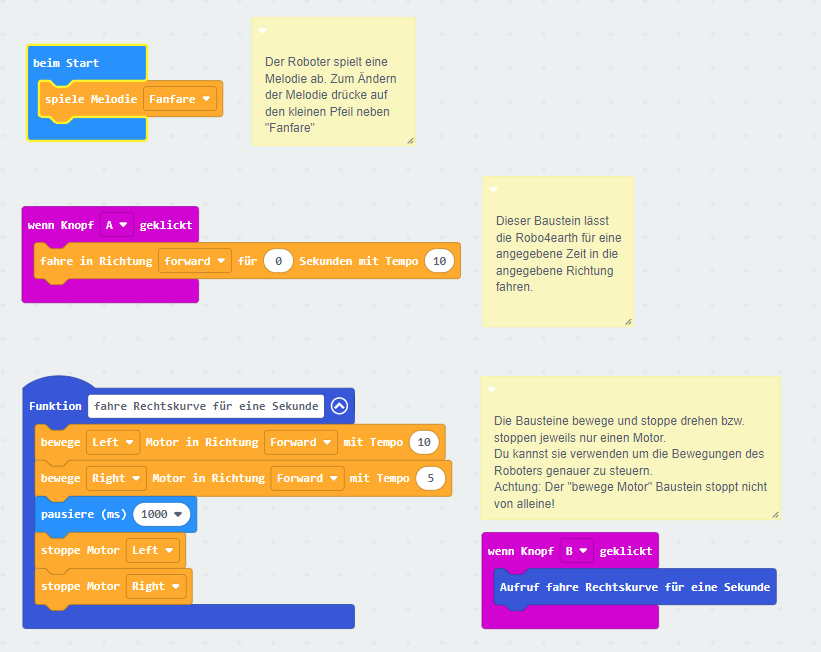

> Diese Seite bei [https://zimdaustria.github.io/r4e-makecode/](https://zimdaustria.github.io/r4e-makecode/) öffnen

# Robot4Earth for MakeCode
Dieses Repository enthält die Makecode Erweiterung für die [ZIMD]() Roboter. Damit kannst du die Roboter bewegen und Musik abspielen. In den Robotern verwenden wir das Motorboard von [Waveshare](https://www.waveshare.com/wiki/Motor_Driver_for_micro:bit). Du kannst die Waveshare Erweiterung verwenden wenn du Servomotoren zu deinem Roboter hinzufügen willst.
Wenn du deine eigene Robot4earth bauen und gestalten willst findest du alle benötigten Materialien auf unserer [robo4earth website](https://www.robo4earth.at/#roboter)

<br/>

## Als Erweiterung verwenden

Dieses Repository kann als **Erweiterung** in MakeCode hinzugefügt werden.

* öffne [https://makecode.microbit.org/](https://makecode.microbit.org/)
* klicke auf **Neues Projekt**
* klicke auf **Erweiterungen** unter dem Zahnrad-Menü
* nach **https://github.com/zimdaustria/r4e-makecode** suchen und importieren

## Dieses Projekt bearbeiten 

Um dieses Repository in MakeCode zu bearbeiten.

* öffne [https://makecode.microbit.org/](https://makecode.microbit.org/)
* klicke auf **Importieren** und dann auf **Importiere URL**
* füge **https://github.com/zimdaustria/r4e-makecode** ein und klicke auf Importieren

## API Code Beispiel
```
function driveRightFor1Second () {
    // drehe die Räder einzeln 
    // mit unterschiedlicher Geschwindigkeit
    r4E.turnMotor(R4eMotor.Left, R4eTurn.Forward, 10)
    r4E.turnMotor(R4eMotor.Right, R4eTurn.Forward, 5)

    // pausiere 1000(ms) 
    // damit sich die Räder 1 Sekunde lang drehen
    basic.pause(1000)

    // stoppe die Räder
    r4E.stopMotor(R4eMotor.Left)
    r4E.stopMotor(R4eMotor.Right)
}
// Funktionsaufruf der oben erstellten Funktion
driveRightFor1Second()

// spielt Melodie Fanfare ab
r4E.playMelody(R4eMelodies.Fanfare)

// der Roboter fährt in die angegebene Richtung
// für 1 Sekunde mit Tempo 10
r4E.move(R4eMotorDirection.forward, 1, 10)
```

## API Blöcke
<br/>

## Blockvorschau

Dieses Bild zeigt den Blockcode vom letzten Commit im Master an.
Die Aktualisierung dieses Bildes kann einige Minuten dauern.


#### Metadaten (verwendet für Suche, Rendering)

* for PXT/microbit
<script src="https://makecode.com/gh-pages-embed.js"></script><script>makeCodeRender("{{ site.makecode.home_url }}", "{{ site.github.owner_name }}/{{ site.github.repository_name }}");</script>
